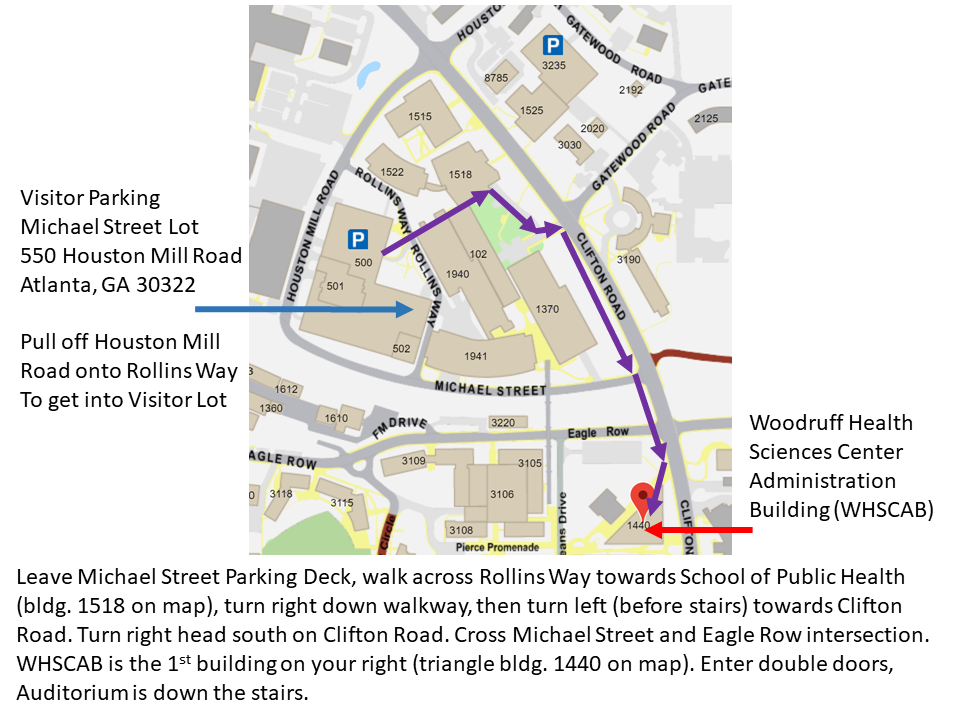

---

#### _Emory University_

#### _Rollins School of Public Health Biostatistics Department_

#### _Nell Hodgson Woodruff School of Nursing,_

#### _Georgia Chapter of the ASA &_ 

#### _R-Ladies of Atlanta_ 

#### _are Excited to Sponsor:_

{width=200px} 

## Dr. Hadley Wickham 
## Chief Scientist RStudio
## Guest Speaker Presentation

---

## Living a Reproducible Life

#### 4:00 - 5:30pm October 16, 2018
#### Woodruff Health Science Center Administration Building (WHSCAB) Auditorium, 1440 Clifton Road, Atlanta, GA 30322

#### BIO:

Dr. Hadley Wickham is the Chief Scientist at RStudio. He is interested in building tools (computational and cognitive) that make data ingest, preparation, manipulation, visualization and analysis easier. He's developed over 30 R packages, for data analysis (`ggplot2`, `dplyr`, `tidyr`), making frustrating parts of R easier to use (`lubridate` for dates, stringr for strings, `httr` for accessing web APIs), and for streamlining the R package development (`devtools`, `roxygen2`, and `testthat`).

#### PRESENTATION SUMMARY:

Dr. Wickham will discuss the benefits for reproducibility on the small scale (e.g. a single scientific paper) which are clear: anything that can be reified and made explicit in code, should be made explicit in code. In this talk, he'll discuss how reproducibility has escaped journal articles in his life and influences almost everything he does. He'll discuss three unexpected venues of reproducibility in his life:

1.	“Writing reproducible books with bookdown, which allows me to generate html, pdf, and epub versions of the text with a press of a key.”
2.	“Writing reproducible blog posts with blogdown, which makes easy to intermingle code and prose in low-stakes explanations of my work.”
3.	“Generating reproducible emails to track shared water usage and inform my neighbours when they owe me money!”

He'll also touch on the intersection of reproducibility and software development, highlighting best practices like unit testing, code coverage, and continuous integration.

#### REGISTRATION AND DIRECTIONS

**Registration Link:**

* [https://eventactions.com/eareg.aspx?ea=Rsvp&invite=gwump82y45b2ccrggusxhyp5gcm5v88cn8hdhgkyc4wd1e7whw45 ](https://eventactions.com/eareg.aspx?ea=Rsvp&invite=gwump82y45b2ccrggusxhyp5gcm5v88cn8hdhgkyc4wd1e7whw45 ).

**Parking:** Link for directions to the Michael Street Parking Deck Visitor Lot 

* 550 Houston Mill Road, Atlanta, GA 30322
* see Visitor Parking Directions at [https://www.sph.emory.edu/about/directions-maps/index.html](https://www.sph.emory.edu/about/directions-maps/index.html)

**Directions** Woodruff Health Sciences Center Administration Building (WHSCAB)

* 1440 Clifton Road, Atlanta, GA 30322
* Room: Auditorium
* [http://whsc.emory.edu/about/maps-and-directions/whscab.html](http://whsc.emory.edu/about/maps-and-directions/whscab.html) 
* To get from the Michael Street Parking Deck to the WHSCAB building (see diagram below)

